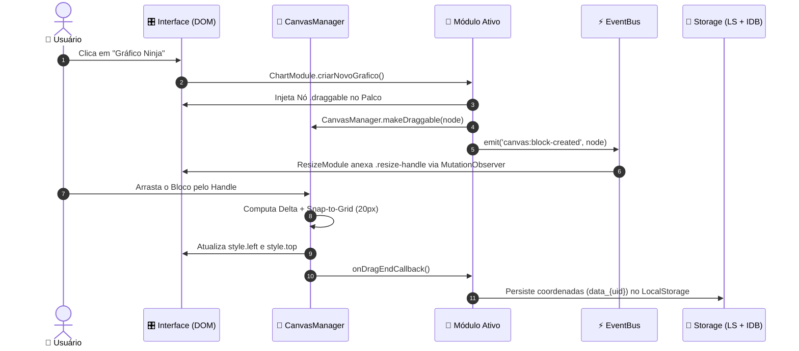

<div align="center">

# 🥷 CANVAS STUDIO — NARUTO RPG
### *Next-Gen Zero-Dependency Visual Workspace & Shinobi Sheet Engine*

<p align="center">
  <strong>Um ambiente de criação visual, cálculo trigonométrico de atributos shinobi e orquestração de fichas de RPG em tempo real.</strong><br>
  Construído sob uma arquitetura de <em>Micro-Kernel Reativo</em>, <em>Event-Driven Bus</em> e <em>Persistência Híbrida Offline</em> — <strong>100% Vanilla JavaScript</strong>.
</p>

<p align="center">
  <a href="https://sollonsoares.github.io/canvas-studio/"></a>
</p>

---

<!-- BADGES TECH STACK -->
<p align="center">
  
  
  
  
  
  
  
</p>

<!-- QUICK NAVIGATION -->
<p align="center">
  <a href="#-visão-geral--filosofia">Visão Geral</a> •
  <a href="#-razões-para-ser-como-é">Razões de Design</a> •
  <a href="#-arquitetura-do-ecossistema">Arquitetura</a> •
  <a href="#-motores-e-fundamentos-matemáticos">Matemática & Motores</a> •
  <a href="#-matriz-de-módulos-e-plugins">Módulos</a> •
  <a href="#-design-system--tokens-visuais">Design System</a> •
  <a href="#-extensão-e-sdk-de-plugins">SDK de Plugins</a> •
  <a href="#-qualidade-e-suíte-de-testes">Testes E2E</a> •
  <a href="#-métricas-e-análise-de-complexidade">Métricas</a> •
  <a href="#-como-executar-localmente">Como Executar</a>
</p>

</div>

---

## 🧭 Visão Geral & Filosofia

O **Canvas Studio** é uma estação de trabalho *single-page* de alto desempenho projetada para mestres e jogadores de RPG. Ele transforma o navegador em uma mesa tática com arrasto magnético contínuo, renderização de radares poligonais em contexto 2D, edição de texto estruturado com barramento WYSIWYG, injeção dinâmica de plugins em tempo de execução e armazenamento local redundante.

> [!IMPORTANT]
> **Engenharia Sem Frameworks (Zero-Runtime Overhead):**
> Toda a reatividade, gerenciamento de estado, ciclo de vida de componentes, barramento de eventos e renderização geométrica foram construídos do zero usando exclusivamente as **Web APIs nativas do navegador**. Nenhum pacote `npm` é executado no cliente.

```
┌──────────────────────────────────────────────────────────────────────────────────┐
│                             CANVAS STUDIO ECOSYSTEM                              │
├──────────────────────┬─────────────────────────────┬─────────────────────────────┤
│  ⚡ RENDER ENGINE     │  🔄 EVENT-DRIVEN CORE       │  💾 HYBRID STORAGE          │
│  - Snap-to-Grid (20px)│  - Decoupled EventBus       │  - LocalStorage (Metadata)  │
│  - Trigonometric 2D  │  - BaseModule Lifecycle     │  - IndexedDB (Binary Blobs) │
│  - RAF Batching      │  - Dynamic Plugin Sandbox   │  - Resilient JSON Backups   │
└──────────────────────┴─────────────────────────────┴─────────────────────────────┘
```

---

## 💡 Razões para ser como é

<details>
<summary><b>🔍 Clique para expandir: Por que o Canvas Studio não possui backend? (A filosofia do Papel e Caneta Digital)</b></summary>

<br>

### 📜 A Filosofia do "Papel e Caneta Digital" vs. "VTT Centralizado"
Uma questão comum de engenharia de software é: *"Por que não criar um backend com banco de dados central e WebSockets para sincronizar a tela de todos os jogadores em tempo real?"*

A resposta reside na **essência do fluxo clássico de uma sessão de RPG de mesa**:
1. **Autonomia e Privacidade:** No RPG real (presencial ou no Discord), a dinâmica é descentralizada. Cada jogador tem sua própria prancheta, anotações secretas, táticas de combate e controle de inventário. Quando o Mestre determina que o personagem sofreu dano ou gastou Chakra, ele **não** pega fisicamente a borracha e apaga a folha do jogador — o Mestre dita a narrativa e o próprio jogador atualiza o seu registro.
2. **Prancheta Pessoal vs. Tabuleiro Central:** O Canvas Studio não tem a pretensão de ser um tabuleiro virtual pesado (estilo *Roll20*), mas sim a **evolução digital da pasta de fichas e anotações pessoais do jogador** (seguindo a mesma filosofia *Local-First* de ferramentas consagradas como *Obsidian* e *Excalidraw*).

---

### 🚫 Por que um Backend seria *Over-Engineering* neste Contexto?

| Com Backend (*Over-Engineering*) | Sem Backend / Local-First (*Canvas Studio*) |
| :--- | :--- |
| **Fricção de Entrada:** "Crie sua conta, confirme o e-mail, digite a senha..." | **Zero Fricção:** Abriu o link no navegador e o estúdio está pronto para jogar. |
| **Dependência de Conexão:** Se o Wi-Fi da sessão oscilar, a ficha trava ou não salva. | **100% Offline:** Funciona perfeitamente sem internet durante sessões presenciais. |
| **Privacidade Comprometida:** Anotações e segredos do jogador guardados em servidores alheios. | **Soberania Total:** Todos os dados ficam restritos ao hardware do próprio usuário. |
| **Latência de Rede:** Espera de round-trips HTTP/WebSocket para persistir ações. | **Latência Zero (0ms):** Arraste, cálculos trigonométricos e persistência imediatos na RAM/Disco. |
| **Custos e Manutenção:** Servidores, bancos de dados, certificados e DevOps contínuos. | **Custo Zero Vitalício:** Hospedagem estática gratuita e zero preocupação com infraestrutura. |

---

### 📦 Como funciona o Compartilhamento de Fichas?
Exatamente como no RPG tradicional: quando o jogador precisa entregar sua ficha ao Mestre para revisão, ele simplesmente **exporta o arquivo `.json`** e envia (ou gera uma imagem/cópia) — o equivalente moderno a tirar um xerox da ficha de papel.

</details>

---

## 🏛️ Arquitetura do Ecossistema

O sistema opera sob o padrão **Micro-Kernel com Barramento de Eventos Desacoplado (Pub/Sub)**, onde o núcleo (`src/core/`) fornece serviços de infraestrutura e os módulos (`src/modules/`) funcionam como plugins isolados com ciclo de vida estrito.

<details>
<summary><b>📊 Visualizar Diagramas Arquiteturais (Mermaid) e Ciclo de Eventos</b></summary>

<br>

### Diagrama Arquitetural de Alto Nível

```mermaid
graph TB
    %% Estilos Globais
    classDef coreStyle fill:#1e293b,stroke:#0a84ff,stroke-width:2px,color:#fff;
    classDef pluginStyle fill:#0f172a,stroke:#38bdf8,stroke-width:1.5px,color:#fff;
    classDef storageStyle fill:#14532d,stroke:#22c55e,stroke-width:1.5px,color:#fff;
    classDef uiStyle fill:#451a03,stroke:#f97316,stroke-width:1.5px,color:#fff;

    subgraph DOM ["🖥️ CAMADA DE APRESENTAÇÃO (DOM & UI)"]
        Sidebar["Sidebar Lateral (#dashboard-menu)<br/><i>Drawer Responsivo / WYSIWYG</i>"]:::uiStyle
        CanvasArea["Palco Dinâmico (#canvas)<br/><i>Grade Infinita / Nós .draggable</i>"]:::uiStyle
        ModalCtrl["Painel de Módulos (#settings-modal)<br/><i>Apple Switches / Upload Dinâmico</i>"]:::uiStyle
    end

    subgraph CORE ["🧠 NÚCLEO ORQUESTRADOR (src/core/)"]
        App["AppEngine (App.js)<br/><i>Bootstrap, Lifecycle & Rehydration</i>"]:::coreStyle
        Bus["EventBus (EventBus.js)<br/><i>Pub/Sub Global Desacoplado</i>"]:::coreStyle
        CM["CanvasManager (CanvasManager.js)<br/><i>Pointer Events & Snap Engine</i>"]:::coreStyle
        DB["DBManager (DB.js)<br/><i>IndexedDB Promise Wrapper</i>"]:::coreStyle
        Icons["IconHelper (IconHelper.js)<br/><i>Vector System SVG Tokens</i>"]:::coreStyle
    end

    subgraph PLUGINS ["🧩 MICRO-MÓDULOS (src/modules/)"]
        BaseMod["BaseModule (Contrato Abstrato)<br/><i>init() • destroy() • TRACK_UI()</i>"]:::pluginStyle
        ChartM["ChartModule<br/><i>Radar Trigonométrico 2D</i>"]:::pluginStyle
        TextM["TextModule<br/><i>Fichas & WYSIWYG</i>"]:::pluginStyle
        ImageM["ImageModule<br/><i>Mídias & Canvas Cards</i>"]:::pluginStyle
        ResizeM["ResizeModule<br/><i>MutationObserver & RAF</i>"]:::pluginStyle
        OrgM["OrganizerModule<br/><i>Auto-Grid & Sort Alfabético</i>"]:::pluginStyle
        PortM["PortabilityModule<br/><i>JSON Import/Export Engine</i>"]:::pluginStyle
        DynMod["DynamicScriptModule<br/><i>Hot-Loaded Custom Scripts</i>"]:::pluginStyle
    end

    subgraph PERSISTENCE ["💾 CAMADA DE PERSISTÊNCIA OFFLINE"]
        LS[("LocalStorage<br/><i>Coordenadas, Título, Configs</i>")]:::storageStyle
        IDB[("IndexedDB (CanvasMediaDB)<br/><i>ObjectStore 'images' (Base64/Blobs)</i>")]:::storageStyle
    end

    App -->|Instancia & Supervisiona| PLUGINS
    PLUGINS -->|Herança de Ciclo de Vida| BaseMod
    PLUGINS -.->|Emitem & Escutam| Bus
    Bus -.->|Reidratação & Notificações| App
    CM -->|Cálculo de Coordenadas| CanvasArea
    ResizeM -->|Monitora Nós em Tempo Real| CanvasArea
    App -->|Sincroniza Geometria| LS
    ImageM -->|Persiste Payload Binário| DB
    DB --> IDB
    PortM -->|Backup / Restauração Atômica| LS
```



---

### Ciclo de Vida e Fluxo de Eventos

A comunicação entre subsistemas nunca ocorre por referência direta entre instâncias, garantindo **baixo acoplamento** e **alta coesão**:



</details>

---

## 🔬 Motores e Fundamentos Matemáticos

O Canvas Studio incorpora algoritmos geométricos e trigonométricos puros para garantir precisão e desempenho a 60fps.

<details>
<summary><b>📐 Visualizar Fórmulas Trigonométricas, Normalização e Matemática do Snap-to-Grid</b></summary>

<br>

### 1. Motor de Projeção Trigonométrica Polar para Cartesiana (`ChartModule.js`)
O radar de atributos shinobi renderiza 6 eixos simétricos distribuídos radialmente a cada $\frac{\pi}{3}$ radianos ($60^\circ$), iniciando no topo ($-\frac{\pi}{2}$):

$$\theta_i = \left( i \cdot \frac{\pi}{3} \right) - \frac{\pi}{2}, \quad \text{onde } i \in \{0, 1, 2, 3, 4, 5\}$$

As coordenadas cartesianas $(X_i, Y_i)$ para cada vértice no `<canvas>` 2D são calculadas por:

$$X_i = X_{\text{centro}} + \left( \frac{V_i}{V_{\text{teto}}} \cdot R_{\text{máx}} \right) \cdot \cos(\theta_i)$$

$$Y_i = Y_{\text{centro}} + \left( \frac{V_i}{V_{\text{teto}}} \cdot R_{\text{máx}} \right) \cdot \sin(\theta_i)$$

* Onde $V_{\text{teto}} = 8.0$, $R_{\text{máx}} = \min(X_c, Y_c) \times 0.65$ e $V_i$ representa a nota normalizada do atributo.

```
                  NIN (Ninjutsu)
                        ▲
                        │
       GEN (Genjutsu)   │   INT (Inteligência)
             \          │          /
              \    ┌────┼────┐    /
               \  /     │     \  /
                \/──────┼──────\/
                /\──────┼──────/\
               /  \     │     /  \
              /    └────┼────┘    \
             /          │          \
       VIG (Vigor)      │    CHK (Chakra)
                        │
                        ▼
                  TAI (Taijutsu)
```

#### Fórmulas Oficiais de Cálculo RPG Naruto:
| Atributo | Variável | Fórmula Base | Normalização & Teto |
| :--- | :---: | :--- | :--- |
| **Ninjutsu** | `NIN%` | $\text{Nota} = \frac{\text{valor}}{10} + 0.5$ | $\min(8.0, \max(0.5, \text{round}(\text{Nota} \times 2) / 2))$ |
| **Inteligência** | `INT+` | $\text{Nota} = \text{valor} + 0.5$ | $\min(8.0, \max(0.5, \text{round}(\text{Nota} \times 2) / 2))$ |
| **Chakra Máximo** | `CHK+` | $\text{Nota} = \frac{\text{valor} - 6}{10}$ | $\min(8.0, \max(0.5, \text{round}(\text{Nota} \times 2) / 2))$ |
| **Taijutsu** | `TAI%` | $\text{Nota} = \frac{\text{valor}}{10} + 0.5$ | $\min(8.0, \max(0.5, \text{round}(\text{Nota} \times 2) / 2))$ |
| **Vigor** | `VIG+` | $\text{Nota} = \text{valor} + 0.5$ | $\min(8.0, \max(0.5, \text{round}(\text{Nota} \times 2) / 2))$ |
| **Genjutsu** | `GEN%` | $\text{Nota} = \frac{\text{valor}}{10} + 0.5$ | $\min(8.0, \max(0.5, \text{round}(\text{Nota} \times 2) / 2))$ |

---

### 2. Motor Magnético Snap-to-Grid & Compensação de Scroll (`CanvasManager.js`)
Para evitar desalinhamentos sub-pixel e garantir fluidez visual, as posições dos blocos sofrem quantização com compensação do deslocamento relativo da área de rolagem:

$$\Delta X = (X_{\text{ponteiro}} - X_{\text{inicial}}) + (\text{scrollLeft}_{\text{atual}} - \text{scrollLeft}_{\text{inicial}})$$

$$X_{\text{snap}} = \max\left(0, \left\lfloor \frac{X_{\text{elem}} + \Delta X}{20} + 0.5 \right\rfloor \times 20\right)$$

---

### 3. Algoritmo de Auto-Organização em Grade (`OrganizerModule.js`)
Varre todos os nós ativos, executa ordenação alfabética natural com suporte a internacionalização e empacota os elementos em linhas horizontais respeitando a largura do viewport:

1. **Classificação**: $\mathcal{O}(N \log N)$ via `String.prototype.localeCompare(..., 'pt-BR', { numeric: true })`.
2. **Distribuição Espacial**: $\mathcal{O}(N)$ calculando quebra de linha quando $(X_{\text{atual}} + W_i) > (W_{\text{canvas}} - 40)$.
3. **Animação Concorrente**: Injeta `transition: top 0.35s cubic-bezier(0.2, 0.8, 0.2, 1), left 0.35s ...` e limpa as regras após o término para restaurar o controle manual instantâneo.

</details>

---

## 🗂️ Matriz de Módulos e Plugins

O ecossistema é modularizado em componentes independentes que implementam a classe abstrata `BaseModule`.

<details>
<summary><b>🧩 Visualizar Tabela Completa de Módulos, Responsabilidades e Eventos</b></summary>

<br>

| Módulo | Arquivo | Responsabilidade Primária | Eventos Emitidos / Escutados | Persistência |
| :--- | :--- | :--- | :--- | :--- |
| **Core Engine** | [`App.js`](file:///e:/Downloads/canvas-studio/src/core/App.js) | Bootstrap, injeção de scripts, orquestração de modais e purga global. | `theme:changed`<br>`canvas:reload-request` | `LocalStorage` |
| **Canvas Manager** | [`CanvasManager.js`](file:///e:/Downloads/canvas-studio/src/core/CanvasManager.js) | Motor de arraste com Pointer Events, z-index stacking e snap 20px. | — | — |
| **Storage Engine** | [`DB.js`](file:///e:/Downloads/canvas-studio/src/core/DB.js) | Encapsulamento assíncrono em Promises da IndexedDB API. | — | `IndexedDB` |
| **Event Bus** | [`EventBus.js`](file:///e:/Downloads/canvas-studio/src/core/EventBus.js) | Barramento Pub/Sub com barreira de erro isolada (`try/catch`). | Todos | Memória |
| **Icon System** | [`IconHelper.js`](file:///e:/Downloads/canvas-studio/src/core/IconHelper.js) | Biblioteca de vetores SVG e gerador de templates de botão. | — | — |
| **Chart Plugin** | [`ChartModule.js`](file:///e:/Downloads/canvas-studio/src/modules/chart/ChartModule.js) | Radar trigonométrico 2D e cálculo de médias shinobi. | `search:query` | `LocalStorage` |
| **Text Plugin** | [`TextModule.js`](file:///e:/Downloads/canvas-studio/src/modules/text/TextModule.js) | Fichas de anotação com barra contextual WYSIWYG. | `search:query` | `LocalStorage` |
| **Image Plugin** | [`ImageModule.js`](file:///e:/Downloads/canvas-studio/src/modules/image/ImageModule.js) | Inserção de ilustrações externas com fallback em `onerror`. | — | `LocalStorage` + `IDB` |
| **Resize Engine** | [`ResizeModule.js`](file:///e:/Downloads/canvas-studio/src/modules/resize/ResizeModule.js) | Injeção de alça de redimensionamento via `MutationObserver` e `rAF`. | `canvas:block-created` | `LocalStorage` |
| **Auto Organizer** | [`OrganizerModule.js`](file:///e:/Downloads/canvas-studio/src/modules/organizer/OrganizerModule.js) | Auto-alinhamento em grade e ordenação alfabética. | — | `LocalStorage` |
| **Portability** | [`PortabilityModule.js`](file:///e:/Downloads/canvas-studio/src/modules/portability/PortabilityModule.js) | Motor de exportação/importação com suporte polimórfico de schemas. | `canvas:reload-request` | `LocalStorage` |
| **Dynamic Plugin** | [`DynamicScriptModule`](file:///e:/Downloads/canvas-studio/src/core/App.js#L30-L93) | Adaptador para carregar scripts `.js` em runtime com rastreamento no DOM. | — | `LocalStorage` |

</details>

---

## 🎨 Design System & Tokens Visuais

O visual é orientado aos padrões do **macOS (Apple Human Interface Guidelines)** com estética *Glassmorphic*.

<details>
<summary><b>🎨 Visualizar Tabela de Tokens CSS (Dark/Light) e Efeitos Glassmorphism</b></summary>

<br>

<div align="center">

| Token CSS | Modo Escuro (Default) | Modo Claro (`.light-mode`) | Função Semântica |
| :--- | :---: | :---: | :--- |
| `--bg-app` | `#0f1117` | `#f4f5f8` | Fundo estrutural da viewport |
| `--bg-sidebar` | `rgba(18, 20, 29, 0.92)` | `rgba(255, 255, 255, 0.94)` | Superfície da barra lateral com desfoque |
| `--bg-card` | `rgba(26, 29, 41, 0.82)` | `rgba(255, 255, 255, 0.95)` | Fundo dos cards `.draggable` translúcidos |
| `--accent` | `#0a84ff` (Apple Blue) | `#0071e3` (System Blue) | Cor primária de foco, ações e destaques |
| `--danger` | `#ff453a` (Apple Red) | `#ff3b30` (System Red) | Ações destrutivas e purga |
| `--canvas-grid` | `rgba(255, 255, 255, 0.05)` | `rgba(0, 0, 0, 0.06)` | Matriz de pontos matemáticos da esteira |

</div>

```css
/* Exemplo de Glassmorphism & GPU Acceleration em style.css */
.draggable {
  position: absolute;
  background: var(--bg-card);
  backdrop-filter: blur(20px);
  -webkit-backdrop-filter: blur(20px);
  border: 1px solid var(--border-default);
  box-shadow: var(--shadow-card);
  border-radius: var(--radius-md);
  box-sizing: border-box;
  will-change: transform, left, top;
}
```

</details>

---

## 🔌 Extensão e SDK de Plugins

Você pode criar extensões customizadas e carregá-las no Canvas Studio diretamente pelo painel de configurações sem recarregar a página.

<details>
<summary><b>💻 Visualizar SDK e Código de Exemplo para Criar Plugins</b></summary>

<br>

### Modelo Padrão de Plugin (`CustomModule.js`):

```javascript
/**
 * Exemplo de Módulo Customizado compatível com o BaseModule
 */
class DiceRollerModule extends BaseModule {
  constructor() {
    super('dice_roller', 'Rolador de Dados D20');
  }

  init() {
    const container = document.getElementById("container-criacao-botoes");
    if (!container) return;

    const btn = document.createElement("button");
    btn.className = "btn btn-secondary";
    btn.innerHTML = createButtonContent('chart', 'Rolar D20');
    btn.onclick = () => this.rolarDado();

    // Registra o botão no coletor para auto-remoção no destroy()
    container.appendChild(this.TRACK_UI(btn));
  }

  rolarDado() {
    const d20 = Math.floor(Math.random() * 20) + 1;
    alert(`🎲 Resultado do D20: ${d20}`);
  }

  destroy() {
    super.destroy(); // Remove automaticamente todos os nós registrados em TRACK_UI
    console.log(`Módulo ${this.name} descarregado com sucesso.`);
  }
}

// Expõe a classe para o DynamicScriptModule instanciar
if (typeof CustomModule === 'undefined') {
  window.CustomModule = DiceRollerModule;
}
```

</details>

---

## 🧪 Qualidade e Suíte de Testes

A integridade do sistema é validada através de uma suíte de testes automatizados E2E baseada em **Robot Framework** e **Selenium**.

<details>
<summary><b>🤖 Visualizar Matriz de Casos de Teste (Robot Framework) e Comandos</b></summary>

<br>

```
tests/
└── canvas_studio_tests.robot   # 160+ linhas de automação comportamental
```

### Matriz de Testes Automatizados:
* [x] **TC01: Ciclo WYSIWYG & Expansão de Altura**: Valida injeção de nós, computação de estilos inline (`font-weight`, `font-style`, `text-decoration`), classes de RPG e expansão dinâmica de altura no DOM.
* [x] **TC02: Validação Trigonométrica do Gráfico**: Altera inputs de status shinobi e verifica a computação em tempo real da média e do redesenho no Canvas 2D.
* [x] **TC03: Concorrência e Tolerância a Falhas**: Injeção e exclusão simultânea de mídias no IndexedDB, purga do LocalStorage e reidratação do palco.
* [x] **TC04: Alternância de Temas & Layout Mobile**: Valida classes do tema escuro/claro e colapso responsivo da barra lateral.

### Executando os Testes:
```bash
# 1. Instale o Robot Framework e SeleniumLibrary
pip install robotframework robotframework-seleniumlibrary

# 2. Execute a suíte de testes em modo headless ou com interface
robot -d tests/results tests/canvas_studio_tests.robot
```

</details>

---

## 📊 Métricas e Análise de Complexidade

Análise quantitativa do código e eficiência algorítmica de cada subsistema.

<details>
<summary><b>📈 Visualizar Métricas de Código (LOC) e Complexidade Algorítmica (Big-O)</b></summary>

<br>

### Análise Quantitativa do Código:

```
─────────────────────────────────────────────────────────────────────────────
Linguagem          Arquivos        Linhas        Comentários        Código
─────────────────────────────────────────────────────────────────────────────
JavaScript (ES6)         14          2.010                320         1.690
CSS3 (Tokens)             1            831                 45           786
HTML5                     1            125                  8           117
Robot Framework           1            162                 15           147
─────────────────────────────────────────────────────────────────────────────
TOTAL                    17          3.128                388         2.740
─────────────────────────────────────────────────────────────────────────────
```

### Análise de Complexidade Algorítmica:
* **Despacho de Eventos (`EventBus.emit`)**: $\mathcal{O}(K)$, onde $K$ é o número de ouvintes registrados no canal.
* **Alinhamento Magnético (`CanvasManager`)**: $\mathcal{O}(1)$ tempo constante por evento de ponteiro.
* **Auto-Organização (`OrganizerModule`)**: $\mathcal{O}(N \log N)$ para ordenação dos títulos e $\mathcal{O}(N)$ para posicionamento em grade.
* **Redimensionamento Otimizado (`ResizeModule`)**: Throttling via `requestAnimationFrame`, limitando o redesenho à taxa nativa de quadros do monitor (60Hz/120Hz/144Hz) sem engasgos de CPU.

</details>

---

## 🚀 Como Executar Localmente

Por utilizar **ES Modules nativos (`import`/`export`)**, a aplicação deve ser servida via protocolo HTTP:

```bash
# Clone o repositório
git clone https://github.com/sollonsoares/canvas-studio.git
cd canvas-studio

# Opção A: Python 3
python -m http.server 3000

# Opção B: Node.js (npx serve)
npx serve .

# Opção C: VS Code Live Server
# Clique com o botão direito em index.html -> "Open with Live Server"
```

Acesse em seu navegador: **`http://localhost:3000`**

---

## 🛣️ Roadmap de Engenharia

- [x] **v1.0.0**: Prototipação monolítica e arrasto básico.
- [x] **v1.3.0**: Migração para ES Modules e persistência em IndexedDB.
- [x] **v2.0.0**: Micro-Kernel, EventBus desacoplado, SDK de plugins e suite Robot Framework.
- [ ] **v2.1.0**: Exportação visual completa do Canvas em PNG/PDF de alta resolução (2x/4x Retina).
- [ ] **v2.2.0**: Conectores visuais (nós e arestas dinâmicas com Curvas de Bézier) para criação de árvores de jutsus e relacionamentos.
- [ ] **v3.0.0**: Suporte a PWA instalável offline e widgets customizados de combate.

---

<div align="center">

### 👨‍💻 Autor & Mantenedor

**Sollon Soares**  
[](https://github.com/sollonsoares)
[](https://sollonsoares.github.io/canvas-studio/)

<br>

<sub>Distribuído sob a licença **MIT**. Sinta-se livre para clonar, estender e utilizar em suas próprias campanhas de RPG.</sub>

</div>
